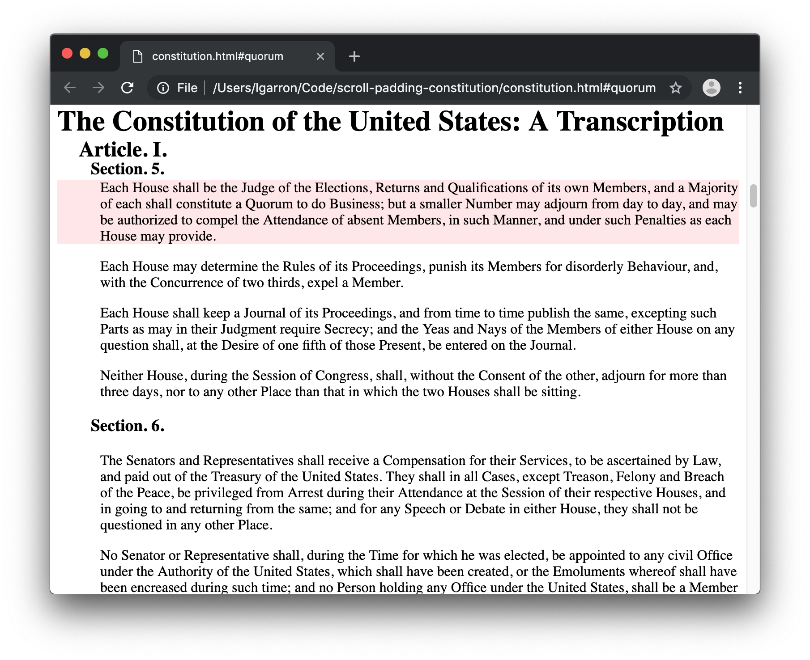

# Scroll Padding Constitution

This is meant as a motivating example for `scroll-padding` in the new [Scroll Snap](https://drafts.csswg.org/css-scroll-snap-1/) spec.

The following are goals of the CSS on the page:
1. The following should all stack when they reach the top of the page, only to be replaced by an element of the same level: `<h1>`, `<h2>`, `<h3>`.
2. A link to a particular anchor on the page (e.g. the [`#quorum`](./constitution.html#quorum) anchor) should scroll to the top as far as it can *after* leaving space for sticky headers.
3. The sticky headings should be able to have dynamic size, e.g. when text overflows due to window resizing.

A simple `scroll-padding-top` CSS rule can satisfy the first two goals, but the need for a fixed padding value prevents the third from working. For example, the title is cut off after "the" in the following screenshot, and extends under other elements to cover some of the anchor-linked text.

I want to know if other parts of the scroll snap spec (e.g. containers) can solve this, else submit this as a use case that I think the spec should be able to address.

# Acknowledgments

The US Constitution used in this example is [from archives.gov](https://www.archives.gov/founding-docs/constitution-transcript).
